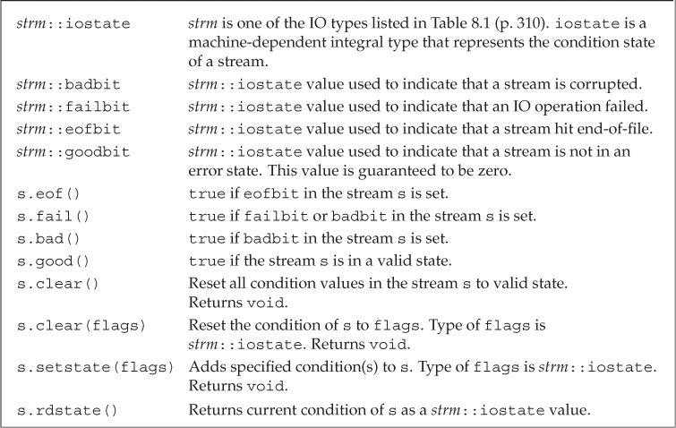
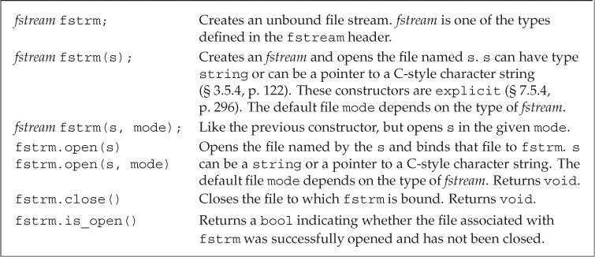

# 第8章 IO库

部分IO库设施：

- `istream`：输入流类型，提供输入操作。

- `ostream`：输出流类型，提供输出操作。

- `cin`：`istream`对象，从标准输入读取数据。

- `cout`：`ostream`对象，向标准输出写入数据。

- `cerr`：`ostream`对象，向标准错误写入数据。

- `>>`运算符：从`istream`对象读取输入数据。

- `<<`运算符：向`ostream`对象写入输出数据。

- `getline`函数：从`istream`对象读取一行数据，写入`string`对象。

## IO类（The IO Classes）

头文件`iostream`定义了用于读写流的基本类型，`fstream`定义了读写命名文件的类型，`sstream`定义了读写内存中`string`对象的类型。


宽字符版本的IO类型和函数的名字以`w`开始，如`wcin`、`wcout`和`wcerr`分别对应`cin`、`cout`和`cerr`。它们与其对应的普通`char`版本都定义在同一个头文件中，如头文件`fstream`定义了`ifstream`和`wifstream`类型。

可以将派生类的对象当作其基类的对象使用。

### IO象无拷贝或赋值（No Copy or Assign for IO Objects）

不能拷贝或对IO对象赋值。

```c++
ofstream out1, out2;
out1 = out2;    // error: cannot assign stream objects
ofstream print(ofstream);   // error: can't initialize the ofstream parameter
out2 = print(out2);     // error: cannot copy stream objects
```

由于IO对象不能拷贝，因此不能将函数形参或返回类型定义为流类型。进行IO操作的函数通常以引用方式传递和返回流。读写一个IO对象会改变其状态，因此传递和返回的引用不能是`const`的。

### 条件状态（Condition States）

IO库条件状态：



`badbit`表示系统级错误，如不可恢复的读写错误。通常情况下，一旦`badbit`被置位，流就无法继续使用了。在发生可恢复错误后，`failbit`会被置位，如期望读取数值却读出一个字符。如果到达文件结束位置，`eofbit`和`failbit`都会被置位。如果流未发生错误，则`goodbit`的值为0。如果`badbit`、`failbit`和`eofbit`任何一个被置位，检测流状态的条件都会失败。

```c++
while (cin >> word)
    // ok: read operation successful...
```

`good`函数在所有错误均未置位时返回`true`。而`bad`、`fail`和`eof`函数在对应错误位被置位时返回`true`。此外，在`badbit`被置位时，`fail`函数也会返回`true`。因此应该使用`good`或`fail`函数确定流的总体状态，`eof`和`bad`只能检测特定错误。

流对象的`rdstate`成员返回一个`iostate`值，表示流的当前状态。`setstate`成员用于将指定条件置位（叠加原始流状态）。`clear`成员的无参版本清除所有错误标志；含参版本接受一个`iostate`值，用于设置流的新状态（覆盖原始流状态）。

```c++
// remember the current state of cin
auto old_state = cin.rdstate();     // remember the current state of cin
cin.clear();    // make cin valid
process_input(cin);     // use cin
cin.setstate(old_state);    // now reset cin to its old state
```

### 管理输出缓冲（Managing the Output Buffer）

每个输出流都管理一个缓冲区，用于保存程序读写的数据。导致缓冲刷新（即数据真正写入输出设备或文件）的原因有很多：

- 程序正常结束。

- 缓冲区已满。

- 使用操纵符（如`endl`）显式刷新缓冲区。

- 在每个输出操作之后，可以用`unitbuf`操纵符设置流的内部状态，从而清空缓冲区。默认情况下，对`cerr`是设置`unitbuf`的，因此写到`cerr`的内容都是立即刷新的。

- 一个输出流可以被关联到另一个流。这种情况下，当读写被关联的流时，关联到的流的缓冲区会被刷新。默认情况下，`cin`和`cerr`都关联到`cout`，因此，读`cin`或写`cerr`都会刷新`cout`的缓冲区。

`flush`操纵符刷新缓冲区，但不输出任何额外字符。`ends`向缓冲区插入一个空字符，然后刷新缓冲区。

```c++
cout << "hi!" << endl;   // writes hi and a newline, then flushes the buffer
cout << "hi!" << flush;  // writes hi, then flushes the buffer; adds no data
cout << "hi!" << ends;   // writes hi and a null, then flushes the buffer
```

如果想在每次输出操作后都刷新缓冲区，可以使用`unitbuf`操纵符。它令流在接下来的每次写操作后都进行一次`flush`操作。而`nounitbuf`操纵符则使流恢复使用正常的缓冲区刷新机制。

```C++
cout << unitbuf;    // all writes will be flushed immediately
// any output is flushed immediately, no buffering
cout << nounitbuf;  // returns to normal buffering
```

如果程序异常终止，输出缓冲区不会被刷新。

当一个输入流被关联到一个输出流时，任何试图从输入流读取数据的操作都会先刷新关联的输出流。标准库将`cout`和`cin`关联在一起，因此下面的语句会导致`cout`的缓冲区被刷新：

```c++
cin >> ival;
```

交互式系统通常应该关联输入流和输出流。这意味着包括用户提示信息在内的所有输出，都会在读操作之前被打印出来。

使用`tie`函数可以关联两个流。它有两个重载版本：无参版本返回指向输出流的指针。如果本对象已关联到一个输出流，则返回的就是指向这个流的指针，否则返回空指针。`tie`的第二个版本接受一个指向`ostream`的指针，将本对象关联到此`ostream`。

```c++
cin.tie(&cout);     // illustration only: the library ties cin and cout for us
// old_tie points to the stream (if any) currently tied to cin
ostream *old_tie = cin.tie(nullptr); // cin is no longer tied
// ties cin and cerr; not a good idea because cin should be tied to cout
cin.tie(&cerr);     // reading cin flushes cerr, not cout
cin.tie(old_tie);   // reestablish normal tie between cin and cout
```

每个流同时最多关联一个流，但多个流可以同时关联同一个`ostream`。向`tie`传递空指针可以解开流的关联。

## 文件输入输出（File Input and Output）

头文件`fstream`定义了三个类型来支持文件IO：`ifstream`从给定文件读取数据，`ofstream`向指定文件写入数据，`fstream`可以同时读写指定文件。



### 使用文件流对象（Using File Stream Objects）

每个文件流类型都定义了`open`函数，它完成一些系统操作，定位指定文件，并视情况打开为读或写模式。

创建文件流对象时，如果提供了文件名（可选），`open`会被自动调用。

```C++
ifstream in(ifile);   // construct an ifstream and open the given file
ofstream out;   // output file stream that is not associated with any file
```

在C++11中，文件流对象的文件名可以是`string`对象或C风格字符数组。旧版本的标准库只支持C风格字符数组。

在要求使用基类对象的地方，可以用继承类型的对象代替。因此一个接受`iostream`类型引用或指针参数的函数，可以用对应的`fstream`类型来调用。

可以先定义空文件流对象，再调用`open`函数将其与指定文件关联。如果`open`调用失败，`failbit`会被置位。

对一个已经打开的文件流调用`open`会失败，并导致`failbit`被置位。随后试图使用文件流的操作都会失败。如果想将文件流关联到另一个文件，必须先调用`close`关闭当前文件，再调用`clear`重置流的条件状态（`close`不会重置流的条件状态）。

当`fstream`对象被销毁时，`close`会自动被调用。

### 文件模式（File Modes）

每个流都有一个关联的文件模式，用来指出如何使用文件。


- 只能对`ofstream`或`fstream`对象设定`out`模式。

- 只能对`ifstream`或`fstream`对象设定`in`模式。

- 只有当`out`被设定时才能设定`trunc`模式。

- 只要`trunc`没被设定，就能设定`app`模式。在`app`模式下，即使没有设定`out`模式，文件也是以输出方式打开。

- 默认情况下，即使没有设定`trunc`，以`out`模式打开的文件也会被截断。如果想保留以`out`模式打开的文件内容，就必须同时设定`app`模式，这会将数据追加写到文件末尾；或者同时设定`in`模式，即同时进行读写操作。

- `ate`和`binary`模式可用于任何类型的文件流对象，并可以和其他任何模式组合使用。

- 与`ifstream`对象关联的文件默认以`in`模式打开，与`ofstream`对象关联的文件默认以`out`模式打开，与`fstream`对象关联的文件默认以`in`和`out`模式打开。

默认情况下，打开`ofstream`对象时，文件内容会被丢弃，阻止文件清空的方法是同时指定`app`或`in`模式。

流对象每次打开文件时都可以改变其文件模式。

```c++
ofstream out;   // no file mode is set
out.open("scratchpad");    // mode implicitly out and trunc
out.close();    // close out so we can use it for a different file
out.open("precious", ofstream::app);   // mode is out and app
out.close();
```

## `string`流（`string` Streams）

头文件`sstream`定义了三个类型来支持内存IO：`istringstream`从`string`读取数据，`ostringstream`向`string`写入数据，`stringstream`可以同时读写`string`的数据。


### 使用`istringstream`（Using an `istringstream`）

```c++
// members are public by default
struct PersonInfo
{
    string name;
    vector<string> phones;
};

string line, word;   // will hold a line and word from input, respectively
vector<PersonInfo> people;    // will hold all the records from the input
// read the input a line at a time until cin hits end-of-file (or another error)
while (getline(cin, line))
{
    PersonInfo info;    // create an object to hold this record's data
    istringstream record(line);    // bind record to the line we just read
    record >> info.name;    // read the name
    while (record >> word)  // read the phone numbers
        info.phones.push_back(word);   // and store them
    people.push_back(info);    // append this record to people
}
```

### 使用`ostringstream`（Using `ostringstream`s）

```C++
for (const auto &entry : people)
{ // for each entry in people
    ostringstream formatted, badNums;   // objects created on each loop
    for (const auto &nums : entry.phones)
    { // for each number
        if (!valid(nums))
        {
            badNums << " " << nums;  // string in badNums
        }
        else
            // ''writes'' to formatted's string
            formatted << " " << format(nums);
    }

    if (badNums.str().empty())   // there were no bad numbers
        os << entry.name << " "  // print the name
            << formatted.str() << endl;   // and reformatted numbers
    else  // otherwise, print the name and bad numbers
        cerr << "input error: " << entry.name
            << " invalid number(s) " << badNums.str() << endl;
}
```